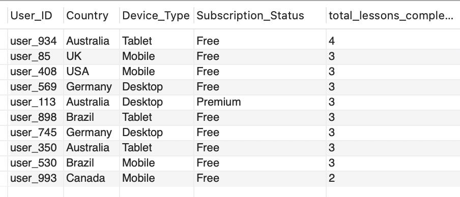
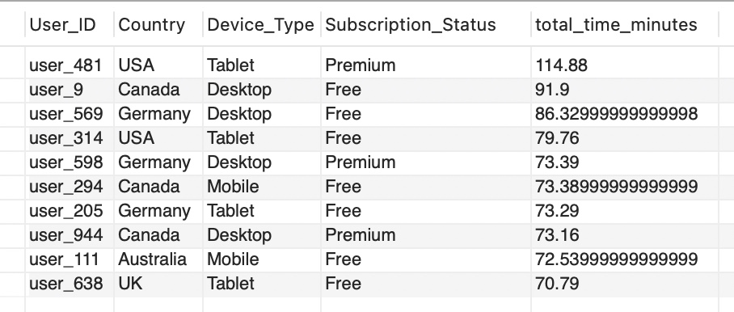

# Giới thiệu dự án
ORECA là một startup công nghệ chuyên phát triển các ứng dụng di động sáng tạo, mang đến trải nghiệm cá nhân hóa cho người dùng. Trong dự án này, tôi sử dụng kỹ năng SQL để phân tích một tập dữ liệu mô phỏng hành vi người dùng trên ứng dụng học đàn piano – một sản phẩm giả lập tương tự định hướng sản phẩm của ORECA. Mục tiêu là khai thác các insight về tần suất sử dụng, mức độ tương tác và hành trình người dùng, từ đó đưa ra đề xuất cải thiện trải nghiệm và giữ chân người dùng.

# Tóm tắt dự án 

## Dataset giả lập tôi dùng cho việc phân tích 

| Feature Name              | Data Type |
|---------------------------|-----------|
| User_ID                   | text      |
| Session_Length_Minutes    | double    |
| Time_of_Day               | text      |
| Lesson_Completed          | int       |
| Difficulty_Level          | text      |
| Notifications_Received    | int       |
| Interacted_With_Feature   | text      |
| Subscription_Status       | text      |
| Rating                    | double    |
| Country                   | text      |
| Device_Type               | text      |

# Insights từ việc phân tích dataset 
## 📊 Tỉ lệ rời bỏ người dùng tính theo trạng thái Free/Premium 

Tỷ lệ rời bỏ (churn rate) của người dùng **Premium** là **9.46%**, cao hơn so với người dùng **Free** là **8.41%**.

Mặc dù thường kỳ vọng người dùng trả phí sẽ trung thành hơn, dữ liệu cho thấy họ có xu hướng rời bỏ nhiều hơn.

Người dùng Premium có tỷ lệ rời bỏ cao hơn người dùng Free (9.46% so với 8.41%), cho thấy họ có thể chưa thấy đủ giá trị từ dịch vụ trả phí hoặc kỳ vọng không được đáp ứng.

Tỉ lệ người dùng rời bỏ app tính theo trạng thái Free/Preimium 
## 📉 Tỉ lệ rời bỏ theo loại thiết bị

Người dùng máy tính bảng có tỷ lệ hủy cao nhất. Điều này cho thấy họ có xu hướng rời bỏ dịch vụ nhiều hơn so với người dùng thiết bị di động.
✅ Giải pháp

- Cải thiện trải nghiệm người dùng trên máy tính bảng (UX/UI).
- Cung cấp các ưu đãi nhằm giữ chân người dùng máy tính bảng.
- Triển khai các chương trình khuyến mãi hoặc giảm giá độc quyền dành cho người dùng máy tính bảng cao cấp để tăng cường sự gắn bó và giảm tỷ lệ hủy.

Tỉ lệ người dùng rời bỏ app tính theo loại thiết bị 

## 📊 Tỉ lệ rời bỏ theo đất nước

Vì file README không hỗ trợ hiển thị trực tiếp biểu đồ Tableau, anh/chị có thể xem biểu đồ tại liên kết sau:

🔗 [Xem biểu đồ trên Tableau Public](https://public.tableau.com/views/ORECAportfolio/Sheet1?:language=en-US&:sid=&:redirect=auth&:display_count=n&:origin=viz_share_link)
### Top 3 đất nước với rating cao nhất (người dùng premium)

### Top 3 đất nước với rating cao nhất (người dùng free)

👉 Sau khi xác định được các quốc gia có người dùng đánh giá cao nhất, công ty nên xem xét triển khai các chiến lược sau để phát triển thị trường tiềm năng:

### 1. Bản địa hóa toàn diện

- **Dịch thuật nội dung**: Chuyển ngữ toàn bộ nội dung ứng dụng sang ngôn ngữ địa phương, đảm bảo tính chính xác và phù hợp văn hóa.
- **Điều chỉnh giao diện người dùng (UI)**: Tùy chỉnh bố cục, màu sắc, hình ảnh và biểu tượng để phù hợp với thẩm mỹ và kỳ vọng của người dùng địa phương.
- **Tùy chỉnh đơn vị tiền tệ và định dạng**: Hiển thị giá cả, ngày tháng và các đơn vị đo lường theo chuẩn mực của từng quốc gia.

### 2. Hợp tác với đối tác địa phương

- Liên kết với các công ty, nhà mạng hoặc nền tảng địa phương để xây dựng uy tín và mở rộng mạng lưới người dùng.

## ↔️ Các loại thiết bị và việc liệu có tương quan giữa hành động tương tác với tính năng của app và lượng piano lesson được hoàn thành hay không

> **Kết luận:** Những người **có tương tác với tính năng** trên app luôn có **số lượng bài học (lesson) được hoàn thành cao hơn** so với những người không tương tác, **bất kể thiết bị nào** được sử dụng.

Điều này chứng minh rằng việc khai thác tính năng đã góp phần tăng mức độ học tập của người dùng.
🔍 **Phân tích**:  
Người dùng có tỷ lệ hoàn thành bài học cao hơn khi thường xuyên tương tác với các tính năng trong ứng dụng.

🎯 **Giải pháp đề xuất**:

- 📣 **Tăng cường hiển thị** các tính năng hữu ích trong app.
- 🧭 **Hướng dẫn sử dụng** tính năng rõ ràng, dễ hiểu.
- 🕹️ **Gamification**: Thêm điểm thưởng, huy hiệu để tạo động lực.
- 🔔 **Nhắc nhở thông minh** để khuyến khích người dùng quay lại học.

👉 Những thay đổi này có thể giúp **nâng cao hiệu quả học tập** và **giữ chân người dùng lâu dài hơn**.

## 📘 Top 10 người dùng có tổng số lesson được hoàn thành nhiều nhất

## ⏰ Top 10 người dùng có thời gian cao nhất

👉 Giải pháp giữ chân người dùng hàng đầu

- **Tặng phần thưởng độc quyền:** badge, lesson nâng cao, hoặc nội dung VIP.  
- **Gửi lời cảm ơn cá nhân hóa:** qua thông báo hoặc email.  
- **Mời tham gia beta tester hoặc cộng đồng riêng:** tạo cảm giác đặc biệt.  
- **Duy trì thử thách định kỳ:** giữ động lực và thói quen học.
